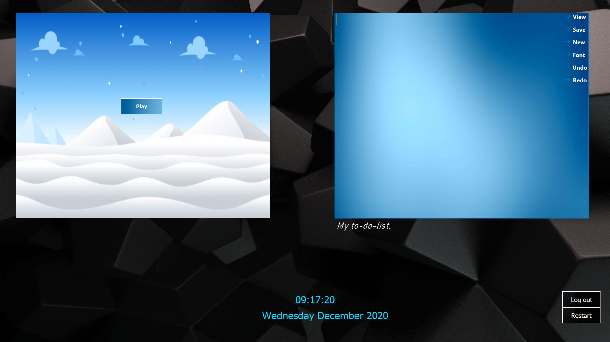
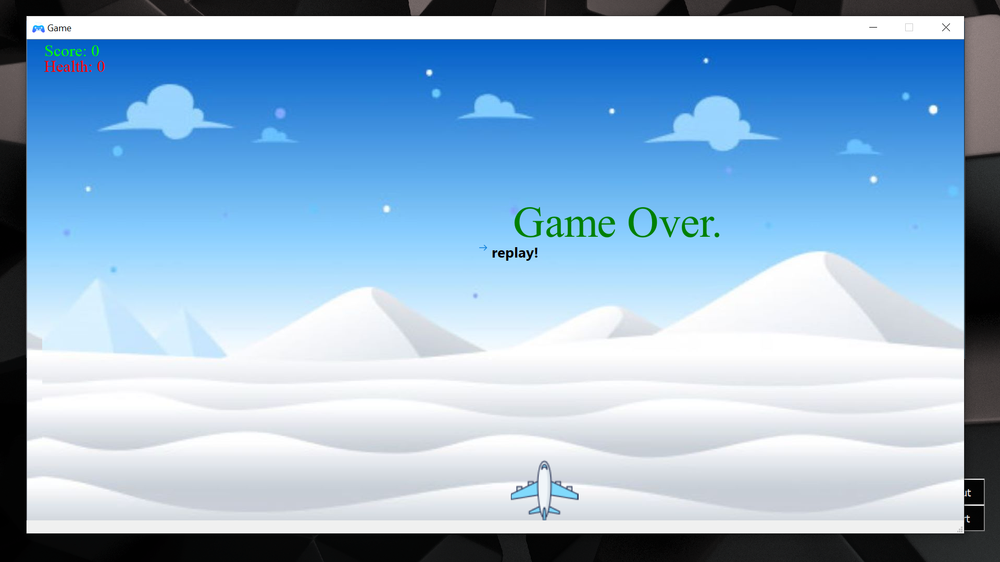

### DE-U (Desktop Environment - Universal)
#### Project Members: 
##### Anju Chhetri(076BEI005)

##### Ashma Yonghang(076BEI007)

This our second semester C++ final course project. This project provides a simple GUI experience to the user. It is created using Qt framework and it consists of three MainWindow (UI).
##### 1) Login Window
 

##### 2) Desktop Window

##### 3) Game Window

